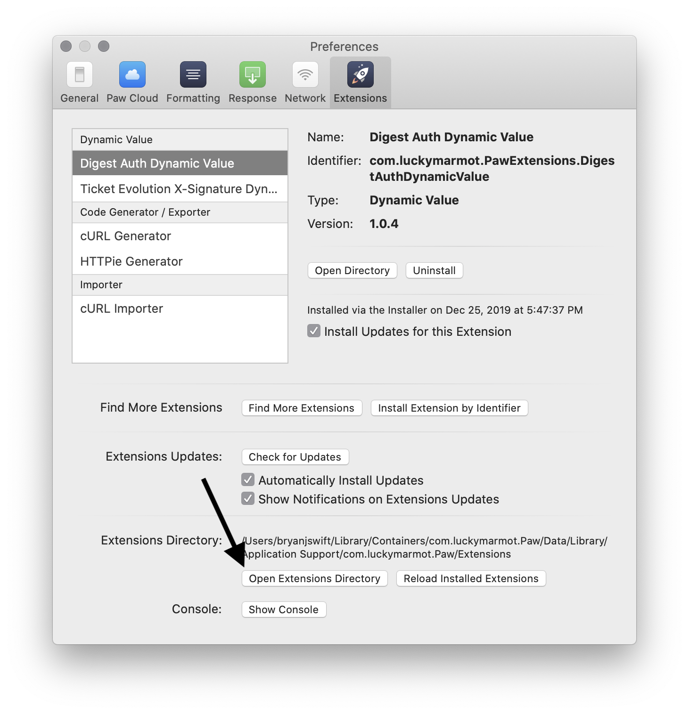

# paw-arra-kba

[Paw][paw] extension to handle KBA validation questions automatically for the user.

Built up from [Paw-TicketEvolutionXSignature](https://github.com/bryanjswift/Paw-TicketEvolutionXSignature).

[tevo-api]: https://ticketevolution.atlassian.net/wiki/spaces/API/pages/983115/Signing+requests+with+X-Signature

[paw]: https://paw.cloud

## Install the Extension

1. Download the [`.zip` archive of the latest version][releases]
1. Open the [Paw][paw] application
1. Open preferences for the Paw application
1. Click on "Extensions" in Paw's preferences
1. Click on the "Open Extensions Directory" button at the bottom of the
   "Extensions" preference pane
   
1. Copy the `.zip` archive of the latest version to the `Extensions` directory
1. Unzip the `.zip` archive which should create a folder named
   `com.dannyhinshaw.PawExtensions.ArrayKBA`

[releases]: https://github.com/dannyhinshaw/ArrayKBA/releases/latest

## Use the Extension

TODO:

## Development

### Prerequisites

```shell
npm install
```

### Build

Compiles the source files into the JavaScript which can be used by the Paw application.

```shell
make build
```

### Install

Moves the built files into the local "Application Support" directory for
`com.array.Paw`.

```shell
make install
```

### Test

```shell
npm test
```

## License

This Paw Extension is released under the [MIT License](LICENSE). Feel free to fork, and modify!

Copyright © 2019 Bryan J Swift
